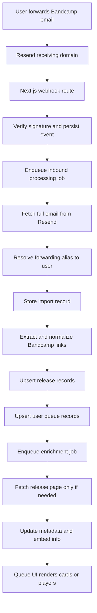
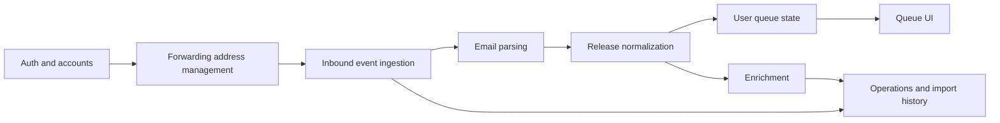

# Bandcamp Listening Queue Development Plan

## Purpose

This document replaces the original product-spec style outline with a build-ready development plan for a greenfield implementation.

It does two jobs:

1. Pressure-test the original assumptions.
2. Turn the idea into a chronological roadmap with checkpoints, decision gates, and delivery slices.

---

## Plain-English Version

We are building a privacy-first web app where a user forwards Bandcamp emails to a personal import address, and the app turns those emails into a listening queue.

The important part is not the player embed. The important part is:

- receiving the forwarded email reliably
- identifying which user it belongs to
- extracting Bandcamp release links safely
- deduplicating repeated forwards
- showing a useful queue item even when parsing is imperfect

If we get those pieces right, the product is valuable even before embeds are polished.

---

## Review Of The Existing Plan

## What is strong

- The privacy model is the right product wedge.
- The data flow is mostly correct.
- The normalization and idempotency concerns are correctly identified.
- The fallback-first approach for unresolved embeds is good.
- The phased thinking is directionally right.

## What is wrong or underspecified

### 1. Auth cannot really be "optional" for a real MVP

If this is a multi-user product, auth is not optional because:

- users need a stable account
- each user needs a unique forwarding address
- queue items must be scoped to a user
- deletion and privacy controls depend on identity

Only a private single-user prototype can skip auth.

### 2. "Do background work inline for now" is a trap

This is the biggest technical risk in the current plan.

Receiving inbound email through a webhook and then doing parsing, link extraction, enrichment, and remote fetches inline is brittle on serverless infrastructure. It works in demos and then fails under retries, timeouts, or duplicate events.

Recommendation:

- verify webhook
- persist event
- enqueue durable processing job
- ack fast

The app should use a durable job system from the start.

### 3. Embed support should not be treated as a core MVP dependency

Bandcamp does support embeds, but resolving them programmatically from arbitrary incoming links may be brittle. The queue should treat a clean fallback release card as the primary UX, and embeds as enrichment.

Recommendation:

- MVP success = imported release card appears reliably
- stretch success = embed resolves for some subset

### 4. Raw email retention needs a stricter data design

The original plan says not to keep full raw email forever, which is right, but the proposed schema still stores full `html_body` and `text_body` directly in the main relational table.

That will create avoidable database bloat and privacy risk.

Recommendation:

- store normalized metadata in Postgres
- store raw email body only when needed for debugging
- attach a retention TTL to raw content
- if long retention is needed, store raw payloads outside the hot relational tables

### 5. There is no explicit first-class queue/inbox state model

The original plan mixes:

- "release exists"
- "user saw it"
- "release is in active queue"
- "same release was imported multiple times"

Those should be modeled separately enough that the UI behavior stays sane.

Recommendation:

- one canonical `release`
- one `user_release` per user plus release
- one or more `import_occurrence` or source-email link rows
- derived queue visibility from `status`, timestamps, and occurrence count

### 6. The plan is product-complete but not execution-complete

It lacks:

- phase zero decisions
- repo bootstrap sequence
- environment setup order
- test strategy by phase
- explicit "stop here and validate" checkpoints
- rollback/de-scope guidance

This new plan adds those pieces.

---

## Recommended Product Definition

## Core promise

"Forward your Bandcamp emails to a private address and get a clean listening queue without granting inbox-wide email access."

## Real MVP

The real MVP is not "perfect parser plus inline players."

The real MVP is:

- a true multi-user product from day one
- user can sign in
- user gets a stable private forwarding address
- a forwarded Bandcamp email reliably creates or updates queue entries
- duplicate forwards do not create junk
- queue items render as useful cards
- user can mark queue state changes
- user can inspect failed imports

If embeds work for some items, great. If not, the product still has value.

### Why this framing is cleaner

This is simpler than a private beta variant because it removes:

- invite-only gating logic
- allowlist handling
- special-case onboarding restrictions
- product ambiguity around whether the app is "real" yet

The tradeoff is slightly more exposure to signup abuse and operational noise, but that is manageable and cleaner than building around a fake-single-user shape.

---

## Proposed Technical Decisions

These are the defaults this development plan assumes.

## Application stack

- App framework: Next.js App Router with TypeScript
- Next.js version target at project start: latest stable major, currently `16.x`
- React version target at project start: stable React matching Next, currently `19.x`
- Styling: Tailwind CSS `v4`
- Package manager: `pnpm`
- Runtime target: Node `24.x`
- Database: Neon Postgres
- ORM and migrations: Drizzle
- Hosting: Vercel
- Inbound email: Resend receiving
- Auth: Clerk
- Durable jobs: Vercel Queues
- File/blob storage for temporary raw email retention: Vercel Blob or S3-compatible storage

## Why these choices

### Clerk over "auth optional"

Plain English:
We need identity from day one if this is a real product.

Technical:
Clerk gives a faster and more complete auth foundation than rolling the product around homegrown email auth or delaying auth entirely. That is useful here because auth is necessary plumbing, not the core differentiator.

### Multiple Clerk sign-in methods

Plain English:
Normally I would tell you to keep auth methods narrow at first, but Clerk makes this a reasonable place to be more flexible.

Technical:
Supporting email/password, Google, and magic links from day one adds some UX and settings complexity, but it does not create much custom auth logic if Clerk owns the flows.

### Durable jobs from day one

Plain English:
Webhook handlers should hand work off quickly and avoid trying to do the whole import in one request.

Technical:
Inbound webhook routes should be idempotent and fast. The parsing pipeline should run in retriable background jobs with durable delivery via Vercel Queues.

### Release cards before embed perfection

Plain English:
A broken queue with a fancy player is worse than a reliable queue with a good fallback card.

Technical:
Treat enrichment as asynchronous post-processing, not import-time blocking work.

### Server-first Next.js architecture

Plain English:
We should treat client components as exceptions, not as the default way to build pages.

Technical:
The app should prefer server components, server actions, route handlers, and direct server-side data access wherever possible. Client components should exist only for clearly interactive UI islands.

---

## Architecture Overview



## Bounded contexts



---

## Data Model Recommendation

The original schema is close, but I would adjust it to reduce ambiguity.

## Recommended core tables

### `users`

- identity and account metadata
- one stable forwarding token per active alias

### `inbound_aliases`

- `id`
- `user_id`
- `token`
- `email_address`
- `status`
- `created_at`
- `rotated_at`

Reason:
This separates user identity from address lifecycle and makes token rotation cleaner.

### `webhook_events`

- provider payload record
- dedupe and processing status

### `inbound_emails`

- resolved inbound email metadata
- minimal normalized fields
- parse status
- reference to temporary raw payload storage if retained

Suggested change:
Do not store large raw HTML/text bodies in the primary hot path table forever.

### `releases`

- one canonical Bandcamp release per normalized URL
- enrichment fields

### `user_releases`

- one row per user plus canonical release
- user state:
  - `new`
  - `listened`
  - `saved`
  - `skipped`
  - `archived`
- first seen timestamp
- last seen timestamp
- import count

### `release_import_occurrences`

- links a `user_release` back to one source email
- useful for debug, dedupe review, and import history

This is cleaner than making one queue-visible row per source email.

### `release_links`

- every extracted raw link
- normalized result
- classification

### `parser_logs`

- optional but strongly recommended
- store stage-specific structured failures

---

## Security And Reliability Requirements

These are not "nice to have." They should shape implementation from the start.

- Verify Resend webhook signatures before enqueueing work.
- Make every job idempotent.
- Use allowlisted Bandcamp domains only.
- Protect all server-side fetches with timeout, redirect limits, and SSRF protections.
- Never render email HTML directly.
- Store the minimum user-identifying email data needed.
- Add retention cleanup for raw payloads early, not later.
- Build an imports/debug page in MVP so failures are visible.

---

## Architecture Decisions Now Locked

These choices are now assumed throughout the rest of the plan.

1. Auth provider: `Clerk`
2. Job system: `Vercel Queues`
3. Raw email retention: `7 days`, debug-only retention
4. Initial release scope: multi-user MVP with open signup
5. Parser scope for first shipment: album and track URLs first
6. Auth methods for first shipment:
   - email/password
   - Google
   - magic link
7. Auth UI priority:
   - emphasize Google and magic link
   - keep password as a secondary option
8. Account linking behavior:
   - use Clerk defaults unless a concrete issue appears
9. Signup model:
   - open signup
   - immediate post-signup onboarding into forwarding-address setup

---

## Delivery Strategy

Build this in vertical slices, not horizontal technical layers.

Bad sequence:

- build every schema
- then every parser
- then every page
- then every job

Good sequence:

- get one user
- one forwarding address
- one email
- one parsed release
- one queue card
- one reliable retry path

That gets feedback sooner and keeps complexity under control.

---

## Phase 0 - Technical Foundation Decisions

## Goal

Make the irreversible decisions before code starts.

## Plain English

This phase prevents us from creating a "half prototype, half product" codebase.

## Tasks

- [ ] Confirm Clerk app setup and environment ownership
- [ ] Confirm Vercel Queues topic and consumer shape
- [ ] Confirm raw email retention TTL is `7 days`
- [ ] Confirm domain naming for inbound email
- [ ] Confirm whether embed work is in MVP or MVP+1
- [ ] Write environment variable contract
- [ ] Define local dev workflow for webhook simulation and email fixture testing

## Checkpoint commit

`chore: define architecture decisions and environment contract`

## Exit criteria

- all major architecture decisions are written down
- Clerk setup shape is agreed
- Vercel Queues integration shape is agreed
- no unknown third-party capability is assumed without validation

---

## Phase 1 - Repo Bootstrap And App Skeleton

## Goal

Create the real app shell and developer workflow.

## Technical scope

- [ ] Initialize Next.js App Router app with TypeScript
- [ ] Configure `pnpm`, linting, formatting, env validation, and basic CI commands
- [ ] Set up Drizzle with Neon
- [ ] Add Clerk
- [ ] Enable email/password, Google, and magic-link sign-in methods
- [ ] Configure the auth UI to emphasize Google and magic link, with password secondary
- [ ] Add Clerk middleware and protected route strategy
- [ ] Add base layout, landing page, sign-in page, and protected app shell
- [ ] Add server-side database client boundaries
- [ ] Add initial schema migrations
- [ ] Add test harness for pure utilities

## Notes

- Prefer server components by default.
- Use server actions for authenticated mutations where possible.
- Avoid client components until UI interaction truly requires them.
- Use `await auth()` from Clerk server APIs in server paths; do not mix server and client auth APIs casually.
- Keep Clerk's default account-linking behavior until a real product need proves it insufficient.

## Checkpoint commit

`chore: bootstrap app auth and database foundation`

## Exit criteria

- user can sign in
- protected app shell works
- database migrations run successfully

## Phase 1 Execution Blueprint

This section turns Phase 1 from a goal list into an implementation-ready scaffold plan.

## Phase 1 defaults

- Use Clerk's prebuilt auth components first
- Do not build custom auth UI in Phase 1
- Use `src/` as the main application code root
- Use `src/app` rather than a root-level `app/` directory
- Use Tailwind CSS `v4` from the start
- Start on Next `16.x` and React `19.x`
- Use server components by default
- Use server actions for authenticated mutations
- Keep the app shell simple and functional, not branded and polished
- Optimize for correctness of auth, env wiring, and data boundaries

### Why this is the right default

Plain English:
The product risk is not "can we design a nice auth page." The risk is "can we stand up a clean, reliable app foundation without creating auth, environment, or data-layer rework later."

Technical:
Using Clerk's prebuilt components in Phase 1 removes low-value UI work and lets the team focus on route protection, database boundaries, and future ingestion flows.

Using `src/app` keeps application code grouped under one root, which is a better fit for a project that will also have db, parsing, queue, and integration code.

## Expected codebase shape after Phase 1

```text
/src
  /app
    /(marketing)
      page.tsx
    /(auth)
      /sign-in/[[...sign-in]]
        page.tsx
      /sign-up/[[...sign-up]]
        page.tsx
    /app
      layout.tsx
      page.tsx
    layout.tsx
  /actions
  /db
    client.ts
    schema/
      users.ts
    migrations/
  /lib
    /auth
      session.ts
    /env
      server.ts
    /utils
  /components
    app-shell.tsx
    auth-gate.tsx
  middleware.ts
```

## Step-by-step work order

### 1. Initialize the application

- [ ] Create the Next.js App Router project with TypeScript
- [ ] Use `pnpm`
- [ ] Install and configure Tailwind CSS `v4`
- [ ] Pin to Next `16.x`, React `19.x`, and Node `24.x`
- [ ] Add the baseline scripts for dev, build, lint, and typecheck

Deliverable:
There is a runnable Next.js app in the repo with no auth or db yet.

### 2. Add environment validation early

- [ ] Define server env parsing in one place
- [ ] Separate required-now values from later-phase values
- [ ] Fail fast if required env vars are missing

Initial env contract for Phase 1:

- `NEXT_PUBLIC_CLERK_PUBLISHABLE_KEY`
- `CLERK_SECRET_KEY`
- `DATABASE_URL`

Reserved for later phases:

- `RESEND_API_KEY`
- `RESEND_WEBHOOK_SECRET`
- `RESEND_AUDIENCE_ID` or equivalent receiving config if needed
- `BLOB_READ_WRITE_TOKEN` or storage provider equivalent

Deliverable:
The app can boot only when required env vars are present, and missing env is caught immediately.

### 3. Add Clerk

- [ ] Install Clerk for Next.js
- [ ] Add `ClerkProvider` at the app root
- [ ] Add middleware with a public-first strategy
- [ ] Make `/` public
- [ ] Protect `/app`
- [ ] Add sign-in and sign-up routes
- [ ] Enable email/password, Google, and magic link in Clerk configuration

Recommended route protection model:

- public:
  - `/`
  - `/sign-in`
  - `/sign-up`
- protected:
  - `/app`
  - future settings, imports, and queue actions

Deliverable:
User can sign up and sign in through Clerk, then access the protected app area.

### 4. Add database foundation

- [ ] Install Drizzle and Neon driver
- [ ] Create db client boundary
- [ ] Create initial schema folder
- [ ] Add first migration

Phase 1 schema should stay deliberately small:

- `users`

Minimum recommended fields for Phase 1:

- internal `id`
- `clerk_user_id`
- `email`
- `created_at`
- `updated_at`

Important note:
Even though Clerk has user records, we still want our own internal `users` table early. It gives us a stable app-level primary key and keeps future domain modeling cleaner.

Deliverable:
Migrations run successfully and the app can query its own `users` table.

### 5. Sync Clerk users into the app database

- [ ] Choose sync strategy for Phase 1
- [ ] Create or update a local user row on first authenticated app load
- [ ] Do not overbuild Clerk webhooks in Phase 1 unless needed

Recommended Phase 1 strategy:

- on first authenticated request into `/app`
- read Clerk identity
- upsert local `users` row by `clerk_user_id`

Why:
This is simpler than starting with webhook-based user sync, and it is enough for the first phases.

Deliverable:
Every authenticated user entering the app gets a corresponding local database record.

### 6. Add the protected app shell

- [ ] Create `/app` layout
- [ ] Create a simple authenticated home page
- [ ] Show signed-in state clearly
- [ ] Add placeholders for future queue/import/settings navigation

Suggested contents of the first `/app` page:

- welcome heading
- current signed-in email
- placeholder "your forwarding address will appear here"
- placeholder queue empty state

Deliverable:
There is a clear before-and-after transition between public marketing routes and the authenticated app.

### 7. Add utility and boundary conventions

- [ ] Put auth-related server helpers under `src/lib/auth`
- [ ] Keep env logic isolated under `src/lib/env`
- [ ] Keep db logic isolated under `src/db`
- [ ] Avoid mixing Clerk access directly into many UI files
- [ ] Prefer route handlers and server actions over client-side fetch patterns

Recommended helper boundaries:

- `src/lib/auth/session.ts`
  - server-only current-user helpers
- `src/db/client.ts`
  - database client creation
- `src/lib/env/server.ts`
  - parsed required env

Deliverable:
The project has a clear place for auth, env, and db access instead of scattering integration code.

### 8. Add baseline testing and validation

- [ ] Add one utility test as a harness proof
- [ ] Add typecheck command
- [ ] Add lint command
- [ ] Verify protected route behavior manually

Phase 1 does not need heavy test coverage yet.
It does need:

- a proven test runner setup
- passing lint
- passing typecheck
- verified auth flow

Deliverable:
The app has a minimal but real quality gate.

## Phase 1 file-by-file intent

### `src/app/layout.tsx`

- wraps app in providers
- sets global shell

### `src/app/(marketing)/page.tsx`

- public landing page
- explains privacy-first email forwarding concept
- calls to action for sign up and sign in

### `src/app/(auth)/sign-in/[[...sign-in]]/page.tsx`

- Clerk sign-in component
- emphasize Google and magic link
- password available but not primary

### `src/app/(auth)/sign-up/[[...sign-up]]/page.tsx`

- Clerk sign-up component
- open signup enabled

### `src/app/app/layout.tsx`

- authenticated shell wrapper
- future navigation placeholders

### `src/app/app/page.tsx`

- first authenticated landing page
- ensures local user upsert exists

### `src/db/schema/users.ts`

- initial app-owned user schema

### `src/lib/auth/session.ts`

- authenticated user helpers
- Clerk server API integration only

### `middleware.ts`

- public/protected route policy

## Phase 1 checkpoint review

Before moving to Phase 2, verify all of this manually:

- [ ] open landing page works while signed out
- [ ] sign up works
- [ ] sign in works with at least one enabled method
- [ ] protected `/app` redirects correctly when signed out
- [ ] signed-in `/app` loads successfully
- [ ] local user record is created or updated
- [ ] lint passes
- [ ] typecheck passes
- [ ] migrations run successfully

## Phase 1 things we are intentionally not doing

- custom auth UI
- Clerk webhooks for user sync
- forwarding-address generation
- inbound email receiving
- queue UI beyond placeholders
- complex navigation
- branding polish

That restraint is important. If we start layering onboarding, inbound email, and auth customization into Phase 1, the foundation phase stops being a foundation phase.

---

## Phase 2 - Forwarding Address And Onboarding Slice

## Goal

Make the product understandable and usable before email ingestion is live.

## Tasks

- [ ] Create user onboarding page
- [ ] Send new signups directly into onboarding after authentication
- [ ] Generate stable inbound alias for each user
- [ ] Store alias lifecycle in database
- [ ] Show copyable forwarding address
- [ ] Add simple Gmail filter instructions
- [ ] Add privacy explanation and data deletion summary
- [ ] Add forwarding token rotation flow

## Checkpoint commit

`feat: add onboarding and personal forwarding addresses`

## Exit criteria

- signed-in user sees a stable forwarding address
- rotating the alias invalidates the old one safely

---

## Phase 3 - Inbound Webhook And Event Capture

## Goal

Receive emails safely and durably without yet promising perfect parsing.

## Tasks

- [ ] Configure Resend receiving domain and webhook
- [ ] Implement webhook signature verification
- [ ] Persist raw webhook event record
- [ ] Deduplicate provider event delivery
- [ ] Enqueue inbound processing job
- [ ] Return success quickly from webhook handler
- [ ] Add local fixture tests for webhook verification

## Important design rule

The webhook route should not parse or enrich the email directly unless it is strictly required for provider compatibility.

## Checkpoint commit

`feat: add reliable inbound email webhook ingestion`

## Exit criteria

- webhook events are stored
- duplicate deliveries do not create duplicate work
- processing is delegated to a durable job

---

## Phase 4 - Email Import Pipeline

## Goal

Turn one forwarded Bandcamp email into one or more user queue records.

## Tasks

- [ ] Fetch full email content from Resend using the received email ID
- [ ] Resolve inbound alias to user
- [ ] Create `inbound_emails` record
- [ ] Extract all candidate URLs from HTML and text
- [ ] Filter to allowlisted Bandcamp release URLs
- [ ] Normalize URLs
- [ ] Upsert canonical releases
- [ ] Upsert `user_releases`
- [ ] Record `release_import_occurrences`
- [ ] Store parser stage results and errors
- [ ] Mark final parse status

## Parsing rule set

Start with a deliberately narrow parser:

- only `album` and `track` URLs
- ignore everything else
- do not try to infer too much from messy content yet

That is less clever, but more dependable.

## Checkpoint commit

`feat: import forwarded bandcamp emails into queue records`

## Exit criteria

- a forwarded email produces queue-visible records
- duplicates increment history instead of creating junk
- malformed emails fail visibly, not silently

---

## Phase 5 - Queue UI And User Actions

## Goal

Make the product feel real even before enrichment is great.

## Tasks

- [ ] Build `/app` queue page
- [ ] Render release cards from `user_releases`
- [ ] Show title, artist, source date, domain, and import state
- [ ] Add user actions:
  - listened
  - saved
  - skipped
  - archived
- [ ] Implement actions with server actions
- [ ] Add `/app/imports` page for failures and history
- [ ] Add `/app/settings` page for privacy controls and alias management

## UX rule

If metadata is incomplete, still show the item with the best known safe fields. Never let a valid import disappear just because enrichment failed.

## Checkpoint commit

`feat: add listening queue imports view and queue state actions`

## Exit criteria

- user can browse queue
- user can update queue state
- user can inspect failed or partial imports

---

## Phase 6 - Metadata Enrichment And Optional Embeds

## Goal

Improve queue quality without making import reliability worse.

## Tasks

- [ ] Create enrichment job for incomplete releases
- [ ] Fetch release page only when needed
- [ ] Extract artist, title, cover, and embed-related hints
- [ ] Store enrichment confidence or status
- [ ] Render inline player only when confidently available
- [ ] Keep release card fallback as the default safety net
- [ ] Add retry action for failed enrichment

## Important boundary

If embed resolution becomes scrape-heavy or brittle, stop and de-scope it. The queue remains shippable without high embed coverage.

## Checkpoint commit

`feat: enrich releases and support safe inline playback fallbacks`

## Exit criteria

- metadata quality improves over time
- unresolved embeds do not break queue rendering

---

## Phase 7 - Hardening And Production Readiness

## Goal

Make the system survivable in production.

## Tasks

- [ ] Add cleanup job for raw retained email bodies
- [ ] Add retry policies with backoff
- [ ] Add dead-letter or failed-job handling path
- [ ] Add import metrics and operational logging
- [ ] Add account deletion flow
- [ ] Add data export or at least transparent deletion confirmation
- [ ] Add rate limiting to public routes
- [ ] Add integration tests for import idempotency

## Checkpoint commit

`chore: harden import reliability privacy and operations`

## Exit criteria

- failures are observable
- retries are safe
- privacy lifecycle is implemented

---

## Suggested PR Or Work Chunk Breakdown

If you want this split cleanly, this is the order I would use:

1. PR 1: app bootstrap, Clerk, db, env
2. PR 2: onboarding and forwarding address management
3. PR 3: webhook ingestion and job plumbing
4. PR 4: email parser and queue record creation
5. PR 5: queue UI and queue state updates
6. PR 6: enrichment and optional embed support
7. PR 7: production hardening

---

## Test Strategy

## Unit tests

- URL normalization
- Bandcamp domain allowlisting
- email classification helpers
- link extraction helpers
- dedupe logic
- queue state transitions

## Integration tests

- webhook signature verification
- duplicate webhook delivery
- one inbound email producing queue records
- one repeated forward incrementing import history
- failed parse surfacing in imports page

## Manual smoke tests

- create account
- copy forwarding address
- forward sample Bandcamp email
- see queue item appear
- change queue state
- inspect import history
- rotate forwarding alias and confirm old alias stops resolving

---

## De-Scope Rules

If schedule pressure appears, cut these first:

1. automatic embed resolution depth
2. advanced email classification
3. favorites and search
4. retention preferences UI beyond a safe default
5. bulk archive and review tooling

Do not cut:

1. auth for a multi-user MVP
2. durable jobs
3. idempotency
4. imports/debug visibility
5. privacy deletion path

---

## Acceptance Criteria

## Product acceptance

- user can sign in
- user receives a personal forwarding address
- forwarding a valid Bandcamp email results in a queue item
- duplicate forwards do not create duplicate visible queue items
- queue item renders even when enrichment is incomplete
- user can change item state
- failed imports are visible to the user or operator

## Technical acceptance

- webhook route is signature-verified and idempotent
- inbound parsing runs via durable async processing
- all remote fetches are bounded and allowlisted
- database schema supports one release shared across many users
- raw email retention is bounded by policy

## Privacy acceptance

- app never requests full inbox access
- only forwarded emails are processed
- deletion flow removes account-linked imported data

---

## First Implementation Order Inside The Codebase

This is the literal build order I would follow.

1. scaffold Next.js app
2. wire env validation
3. add database and migrations
4. add auth
5. add protected app shell
6. add forwarding alias generation
7. add onboarding page
8. add webhook capture route
9. add durable job dispatch
10. add full email retrieval
11. add link extraction and normalization
12. add release plus user-release persistence
13. add queue page
14. add imports page
15. add enrichment job
16. add hardening and cleanup

---

## Implementation Defaults Locked

The remaining implementation defaults are now fixed:

1. enable email/password, Google, and magic link
2. emphasize Google and magic link in the auth UI
3. keep password available as a secondary option
4. use Clerk's default account-linking behavior
5. use open signup
6. send successful signups directly into onboarding
7. keep raw email content for `7 days` in debug-only retention

With these choices locked, the document is ready to serve as the implementation baseline.
